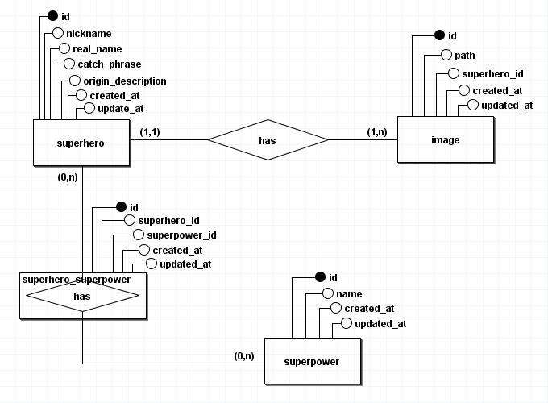
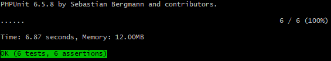

## Model Entity Relationship

## Production Address:
- http://superheroacademy.herokuapp.com/

## About Superhero Academy
 Superhero Academy is a web application that allows the Superhero CRUD operations. In this system can you do:
 - CRUD Superheroes that includes: 
    - Create and Edit Superpowers to attach in a Superhero.
    - Attach any Images in a Superhero.

## Setup
 1. Install WAMP.
 2. Clone the project repository and install it in the **wamp/wwww** folder.  
 3. Run migrations `php artisan migrate`. Make sure that the following tables have been created: _Superhero_, _Superpower_ and _Images_.

## Run Unit Tests
1. With opened terminal in the root project run `vendor/bin/phpunit`.
2. Your terminal must be show as the below image:

   

## Test Cases
- Create a Superpower: 
  1. Click in Superpower Aba.
  2. Fill in the Name field.
  3. Submit.
  4. The following message will be shown: `Superpower Successfully Resgistered.`

- Create a Superhero:
  1. Click in Superhero Aba.
  2. In the page will be show the Superhero Listing. Click in the Circular Button localized in the page top.
  3. Fill the Following Fields: _Nickname_, _Real Name_, _Catch Phrase_, _Origin Description_. 
  4. Now you will add as many _Superpowers_ as you want in you Superhero. 
    - Click In the _Superpower_ field.
    - Select a Superpower.
    - Click in the Right Circular Button to Append Superpower below.
    - You can delete this item from list by clicking the right trash icon.
  5. Now you will add as many _Images_ as you want in you Superhero.
    - Click In the input field and Select the Image [Make Sure the Image was downloaded from web].
    - If you want add more images click in the Right Circular Button and Click the input field appended below.
    - You can delete this item from list by clicking the right trash icon.
  6. Submit.
  7. The following message will be shown: `Superhero Successfully Resgistered.`        

- Edit a Superhero:
  1. Click in Superhero Aba.
  2. In the page will be show the Superhero Listing. Click in the Superhero Pencil Icon that you want edit.
  3. In Superhero Edit you can Edit de Fields, Add/Delete Superpowers and Add/Delete Images separately:
    1. Edit Fields:
      - Fill the superhero fields with new values.
      - Submit.
      - The following message will be shown: `Superhero Successfully Edited.`
    2. Edit Superpowers:
      - You can Delete it Clicking the right trash icon. A Successfully Alert will be show in the top page.
      - You can Add it in the Right Mini Form by Selecting the _Superpowers_ that you want.
        - Submit.
        - The following message will be shown: `Superpowers Successfully Added.`
    3. Edit Images:   
      - You can Delete it Clicking the trash icon. A Successfully Alert will be show in the top page.
      - You can Add it in the Right Mini Form by Selecting the _Images_ that you want.
        - Submit.
        - The following message will be shown: `Images Successfully Added.`

- Delete a Superhero:
    1. Click in Superhero Aba.
    2. In the page will be show the Superhero Listing. Click in the Superhero Trash Icon that you want delete.
    3. Confirm the Deletion.
    4. The following message will be shown: `Superhero Successfully Deleted.`
